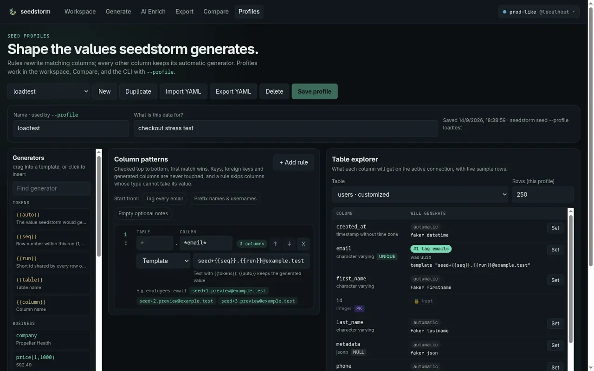

# Seed Profiles

A seed profile is a small YAML document of **value rules**. Rules rewrite matching
columns while every other column keeps seedstorm's automatic generator. Use them
to tag seeded data so it is easy to find and delete, to pin a column to a value,
or to leave a column empty.

Profiles work everywhere:

| Surface | How |
|---------|-----|
| CLI | `--profile <file-or-name>` on `seed`, `gaps`, `generate`, `mirror` |
| TUI | the same flag with `--interactive`; the review screen shows the active profile |
| Web UI | build and save on **Profiles**; pick one in the workspace or on **Compare** |

Profiles saved in the web UI live in `~/.config/seedstorm/profiles.yaml`
(`$XDG_CONFIG_HOME` honoured, file `0600`). Override the location with
`SEEDSTORM_PROFILES`. A `--profile` value that is an existing file is read from
disk; anything else is looked up by saved name or id.



## Format

```yaml
version: 1
name: loadtest
description: Checkout stress test; every row is tagged for cleanup
rules:                       # pattern rules, checked top to bottom
  - name: tag emails
    column: "*email*"        # glob, case-insensitive (required)
    template: "lt+{{seq}}.{{run}}@example.test"
  - table: "audit_*"         # glob, default "*"
    column: "*_name"
    template: "LT {{auto}}"
ignore:                      # tables never written (globs, case-insensitive)
  - flyway_*
  - "*_audit"
tables:                      # explicit settings per table
  users:
    rows: 500                # rows for seed/generate/gaps (mirror ignores it)
    columns:
      role: { value: guest }
      phone: { setNull: true }
relationships:               # children per parent for a foreign key (version 2)
  orders.user_id:
    min: 1
    avg: 5.2
    max: 34
    zeroShare: 0.19          # share of parents with no children
    nullShare: 0             # share of NULL keys (nullable columns)
    histogram:               # optional: parents per degree range
      - {min: 1, max: 1, parents: 187}
      - {min: 2, max: 3, parents: 340}
      - {min: 4, max: 7, parents: 310}
      - {min: 8, max: 34, parents: 133}
```

### Relationships

`relationships:` makes foreign keys look like real data instead of an even
spread: most users with a few orders, some with many, some with none. Each key
is `table.column` (matched to the database ignoring case). Seed, fill empty,
generate and mirror deal parents so that:

- no parent gets more than `max` children, and each parent with children gets at least `min`;
- the share of parents without children is `zeroShare`, and exactly `nullShare` of the rows have a NULL key;
- degrees follow the `histogram` when given (bucket by its parent weight, then a value inside it), otherwise they spread around `avg`.

Every foreign key of a table can be shaped at once; the keys are dealt
independently, so they are not correlated (the users with many orders are not
necessarily the ones with many reviews).

When the planned rows cannot fit the shape, seedstorm adjusts in one bounded
pass and warns instead of retrying: `max raised`, `share of parents without
children lowered`, or fewer parents with children. More rows than planned
(enum coverage) pick parents evenly and are reported. After a run that writes,
the achieved shape is measured and logged next to the target.

Not shaped (validation warns with the reason): self-references, junction
tables whose key is made of foreign keys, key columns. Parents above 500,000
rows are shaped over the sample of parents seedstorm keeps, so the shape is
approximate for them.

Where shapes come from:

- **Analyze relationships** in the workspace, `seedstorm snapshot --relationships`
  or `introspect --relationships` measure them from a database; **Import from a
  counts file** on the Profiles page turns such a file into `relationships:`.
- `seed --shape-rows` derives the row count of each shaped child table from its
  parents (parents × (1 − zeroShare) × avg ÷ (1 − nullShare)); `--table-rows`
  still wins.
- `mirror --shape-like-source` (or **Shape relationships like the source** on
  Compare) uses the source's shapes directly, without a profile.

A profile with relationships is written as `version: 2`; older seedstorm
versions refuse it rather than seeding it unshaped. Without relationships a
profile stays `version: 1`.

### Ignored tables

`ignore:` lists table-name globs that seedstorm never writes: seed, gaps, generate and mirror skip them (no inserts, no truncation). Globs match the whole name and ignore case, so `flyway_*` also matches MySQL's `FLYWAY_SCHEMA_HISTORY`; `*` matches any run of characters and `?` exactly one.

A seeded table can still point at an ignored one. If its FK column is NOT NULL, the ignored table must already have rows, which new rows reference; if it is empty the run stops with an error naming both tables (mirror skips the child and says why). Nullable FKs to an empty ignored table are left NULL. Validation warns when a glob matches no table, and when a table has rules under `tables:` that never apply because it is ignored.

### Actions

Each rule sets exactly one action.

| Action | Example | Writes |
|--------|---------|--------|
| `template` | `"lt+{{seq}}@example.test"` | Text with `{{tokens}}` |
| `faker` | `number(18,90)` | One generator (see the palette or `faker` list below) |
| `value` | `guest` | The same value on every row |
| `oneOf` | `[admin, user, guest]` | A random pick from the list |
| `setNull` | `true` | `NULL` (nullable columns only) |

### Template tokens

| Token | Renders |
|-------|---------|
| `{{auto}}` | The value seedstorm would have generated, so `seed_{{auto}}` is a prefix |
| `{{seq}}` | Row number within the run: 1, 2, 3… (continues across internal chunks) |
| `{{run}}` | Short id shared by every row of one run, handy for cleanup: `WHERE email LIKE '%.1bddc1@%'` |
| `{{table}}` / `{{column}}` | Table and column name |
| `` | Any generator, e.g. `{{email}}`, `{{number(1,9)}}`, `{{numerify(###-####)}}` |

A template that is exactly one token keeps that token's type, so
`{{number(1,9)}}` stays an integer.

Generators: `name firstname lastname username jobtitle email url domain ipv4
macaddress phone street city state country zip latitude longitude company
productname price(min,max) word sentence paragraph(n) lexify(????)
numerify(###) hexcolor number(min,max) float64 bool randomstring(a,b) date time
datetime uuid json`.

## How rules resolve

1. An explicit `tables.<table>.columns.<column>` rule wins.
2. Otherwise the **first** pattern rule whose globs match and whose action fits the
   column applies.
3. Otherwise the automatic generator stays.

Rules adapt to each database instead of breaking it:

- **Protected columns** — primary keys, foreign keys and generated columns are
  never rewritten. Pattern rules skip them; an explicit rule on one is an error.
- **Type-aware** — a pattern rule skips columns that cannot take its output: a
  template with literal text is not applied to integer, timestamp, uuid or enum
  columns; `setNull` skips `NOT NULL` columns. The next matching rule is tried.
- **Coercion** — values written to numeric or boolean columns are parsed; a value
  that does not parse fails with the table, column and value in the message.
  Strings are cut to the column's declared length.
- **Enum coverage** — a column rewritten by a rule no longer adds enum top-up rows.
- **UNIQUE constraints** — single- and multi-column UNIQUE constraints stay satisfied, including against rows already in the database. When a rule makes a tuple repeat, seedstorm regenerates a column the rule does not own; if every column of the constraint is fixed, the row is dropped and reported (`no more distinct values for UNIQUE (realm_id, username)`).
- **Any engine's identifier case** — names under `tables:` match exactly first, then ignoring case, so a profile written as `user_entity.username` also drives MySQL's `USER_ENTITY.USERNAME`.
- **Portable booleans** — `value: true` works on a Postgres `boolean` and on MySQL's `TINYINT(1)` / `BIT(1)`.
- **Repeat runs** — `{{seq}}` restarts at 1 every run. On a UNIQUE column add `{{run}}` (`kc_user_{{run}}_{{seq}}`) so later runs and mirror top-ups do not collide; validation warns when you don't.

Validation (web UI issues panel, `seedstorm profile validate --dsn …`) reports:

| Level | Examples |
|-------|----------|
| error | no action / two actions, unknown generator or token, bad glob, explicit rule on a key, `setNull` on `NOT NULL`, a value that cannot fit the column type |
| warning | table or column not in this database (profiles stay portable), a rule that matches nothing or is shadowed by an earlier rule, a UNIQUE column (or a column inside a multi-column UNIQUE) given a fixed value or short list, a UNIQUE template relying on `{{seq}}` alone, a relationship on a key that cannot be shaped |
| error (relationships) | a key not written as `table.column`, max below min, avg outside min … max, shares outside 0 … 1, a bucket with min above max |

## CLI

```bash
# Use a file
seedstorm seed --dsn "$DSN" --schema schema.yaml --profile loadtest.yaml

# Use a profile saved in the web UI
seedstorm mirror --source-dsn "$PROD" --target-dsn "$STAGE" --profile loadtest

# Manage saved profiles
seedstorm profile list
seedstorm profile show loadtest > loadtest.yaml     # export
seedstorm profile import loadtest.yaml              # save or replace by name
seedstorm profile validate loadtest --dsn "$DSN"    # check against a live schema
seedstorm profile delete loadtest
```

```text
$ seedstorm profile list
NAME      PATTERN RULES  TABLES  UPDATED           ID
loadtest  2              1       2026-09-14 16:54  p_360624b0bdc8

$ seedstorm profile validate loadtest --dsn "$DSN"
OK: 2 pattern rule(s), 1 table(s), 0 warning(s)
```
